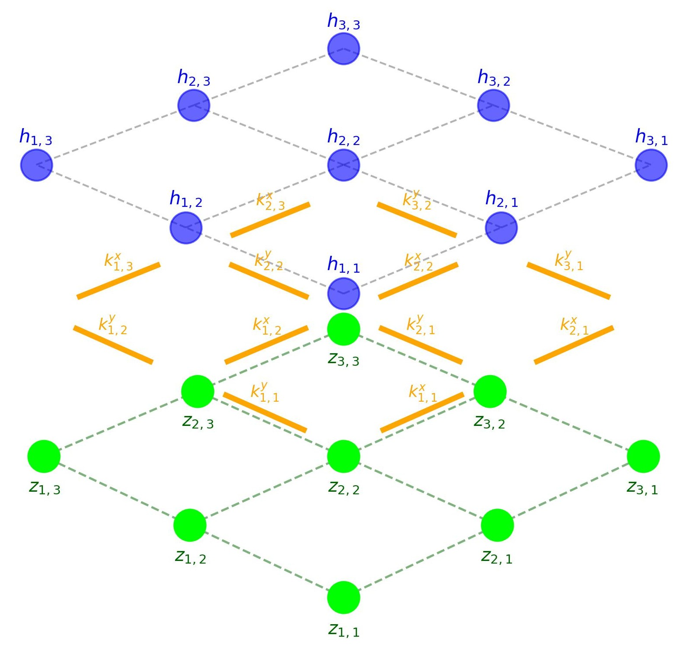
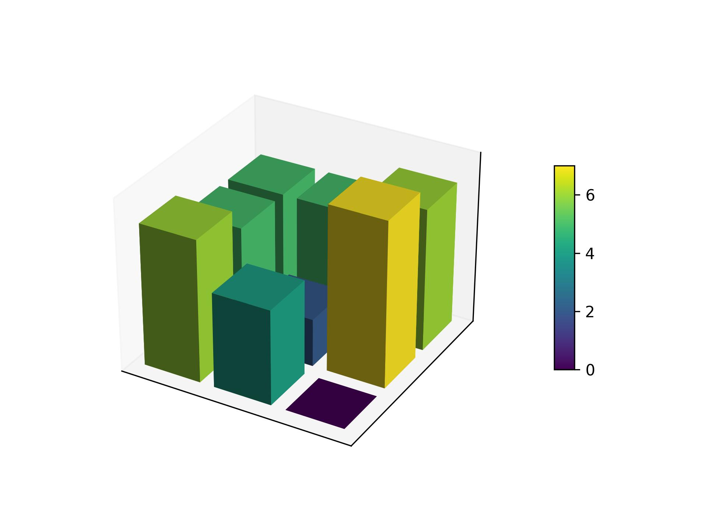
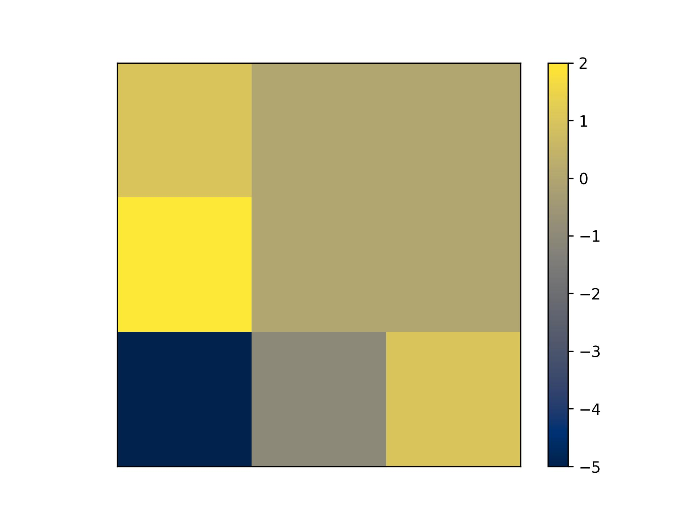
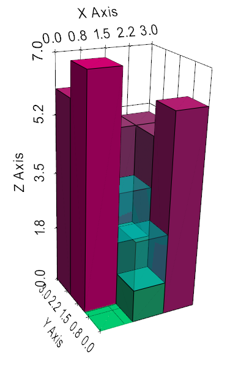

# QUBO for deterministic-8 and flow accumulation:
another edge between Quantum Computation and Hydrology

## Abstract

Flood risk management has become a major area of research for those institutions and administrations endorsed with forecasting and damage mitigation, not only due to precipitation but also due to infrastructure failure. *Deterministic-8* is a standard algorithm in the sequence of routines applied to predict the way a volume of fluid will distribute over the land accessible to it. The continuous version of the problem is a dynamical one with constrictions for which a traditional Lagrange multipliers approach is natural. A lattice version of it is NP-complete complexity-wise and computationally is well suited for a quantum approach the latter being the object of this paper.

---

# INTRODUCTION

Flood risk assessment and subsequent damage prevention is gaining attention in recent years. Even more acute is the urge for enhancing the prediction tools available for the agents watching regions where the actual models are lacking or outdated due to new trends in precipitation patterns, land-use, obsolete infrastructures or new legislation (many plans are requiring longer *return periods*) in many circumstances, all these issues concurring all at once.

Dramatic flash-flood events like the one that hit Spain on October 29th, 2024, with over 230 deaths, and which could have been increased by one or two orders of magnitude had a nearby dam fail, as it seemed plausible at the time (Calvo-Sancho et al. 2026), are of special interest.

*Deterministic-8* is a widely used routine in the pre-processing stages of hydrologic studies for flood planning and is provided in industry standard toolkits like SAGA (Conrad et al. 2015). The goal of the problem is forecasting how a certain amount of water initially localized over some area will spread in its surrounding area.

Machine Learning and Quantum Computing (Combarro and González-Castillo 2023, 2025) have not yet fully entered this active field of Hydrology but the problems posed are very suitable for its application.

The rest of this manuscript is devoted to building a general Quadratic Unconstrained Binary Optimization (QUBO) representation containing the Deterministic-8 method, applying it to selected cases to showcase its use, ending with conclusions.

---

# Theoretical Formulation

We follow notation introduced by O'Malley (2018) whenever possible.

## Deterministic-8 General QUBO

Deterministic-8 is a method self-described by its own name, being the first solution anyone can think of when faced with deciding, like in a boardgame, how to move in a square grid from one square to the next one.

Simply put: explore all the next cells where you can move to check if doing so brings you closer to your goal, moving to the most favorable ones.

Several at the same time, or many times, when time presses, shifting to only one just like a *one hot* problem.

This is precisely how it is done in the SAGA tools (Conrad et al. 2015), an industry standard in the field of preprocessing Digital Elevation Models for later use in modeling software like HEC‑RAS, QGIS, iRIC or Iber.

In our present case, identification with the 2‑D model discussed by O'Malley (2018) is direct.

We start at time $t = 0$ with a 3×3 grid of vertices which will be our potentially flooded area, and we set on the vertex $h_{2,2}^0$ our aquifer.

The variables are binary:

$$
h_{i,j}^t \in \{0,1\}
$$

where $h_{i,j}^t = 1$ if the cell is filled and $0$ otherwise.

We define a multiplicative constant $\alpha_{i,j}^t$ accounting for the free-surface water height of the cell.

The terrain elevation is represented by:

$$
z_{i,j}^t
$$

and the signed edge gradients by:

$$
k_{i,j}^{\mu}
$$

where $\mu \in \{x,y\}$.

---

## Three-layer representation

---

## Free Lagrangian

The function to optimize is the negative of the potential energy:

$$
L_{free} = -V = -\sum_{i,j}(\alpha_{i,j}^t + z_{i,j}^t) h_{i,j}^t
$$

subject to mass conservation:

$$
\alpha_{i,j}^0 h_{i,j}^0 = \sum_{i,j} \alpha_{i,j}^t h_{i,j}^t
$$

Water spreads but is conserved.

---

## Directional switch

Movement along the $x$ axis is encoded through:

$$
\frac{z_{i+1,j}^t - z_{i,j}^t}{|z_{i+1,j}^t - z_{i,j}^t|}
=
\begin{cases}
-1 & z_{i+1,j}^t < z_{i,j}^t \\
0 & z_{i+1,j}^t = z_{i,j}^t \\
1 & z_{i+1,j}^t > z_{i,j}^t
\end{cases}
$$

Using the $k_{i,j}^{\mu}$ notation:

$$
\hat{k}_{i,j}^{\mu,t} =
\frac{k_{i,j}^{\mu,t}}{|k_{i,j}^{\mu,t}|}
$$

This activates or deactivates the interaction term according to the terrain gradient.

---

## Interaction term

$$
L_{int}^{bare} =
-\frac{1}{2}(1-\hat{k}_{i,j}^{\mu,t})
$$

which behaves as:

$$
\begin{cases}
-1 & \hat{k}_{i,j}^{\mu,t} = -1 \\
0 & \text{otherwise}
\end{cases}
$$

---

## Full QUBO

$$
L =
-\sum_{i,j}(\alpha_{i,j}^t + z_{i,j}^t)h_{i,j}^t
-\frac{1}{2}(1-\hat{k}_{i,j}^{\mu,t})
\sum_{i,j}
[(\alpha_{i,j}^{t+1}+z_{i,j}^t)h_{i,j}^{t+1}
-(\alpha_{i,j}^{t}+z_{i,j}^t)h_{i,j}^{t}]
+ \gamma
\sum_{i,j}(\alpha_{i,j}^0 h_{i,j}^0
-\alpha_{i,j}^t h_{i,j}^t)
$$

---

# Physical considerations

In this model no other physical effect is considered.

Nonetheless it is legitimate to let the amount of water vary with time (e.g. rainfall or release of a dam) by varying the $\alpha_{i,j}^t$ consistently.

The spreading of water discretized as in this model is a natural example of an Ising-like nearest-neighbor interaction problem.

---

# In Machina implementation description

We now apply the model to showcase examples.

---

# Showcase examples

## 1‑D Dam failure

We remove the $j$ index as there is no need for it.

### Initial state

Terrain:

$$
z_0^0 = z_1^0 = 1
$$

and:

$$
[h_0^{t=0}=1,\alpha_0^{t=0}=2]
$$

### Final state

$$
[
[h_0^{t=1}=1,\alpha_0^{t=1}=1],
[h_1^{t=1}=1,\alpha_1^{t=1}=1]
]
$$

---

## 3‑D flooding

### Terrain

$$
z_{i,j}^0 =
\begin{bmatrix}
6 & 5 & 5 \\
7 & 2 & 5 \\
0 & 4 & 6
\end{bmatrix}
$$

### Channel network

At time $t=1$ a possible state is:

$$
[
[h_{2,2}^{t=1}=1,\alpha_{2,2}^{t=1}=2],
[h_{1,2}^{t=1}=1,\alpha_{1,2}^{t=1}=1]
]
$$

---

# Conclusions

The simplicity of this proof‑of‑concept model makes it suitable to be coded using almost any framework for quantum computing at the present time.

In D‑Wave's Ocean SDK this can be achieved using a quadratic model and an ExactSolver without requiring actual quantum hardware.

A larger scale implementation for massive grids remains under development.

The arrival of Quantum Optimization to the field of flood risk assessment is promising, though still at an early stage.

---

# References

- Calvo‑Sancho et al. (2026). *Nature Communications*.
- Combarro & González‑Castillo (2023, 2025).
- Conrad et al. (2015). SAGA GIS.
- Costa & Pessoa (2021).
- O'Malley (2018).
- Olarra (2026).
- Qiskit contributors.
- US Army Corps of Engineers — HEC‑RAS.
